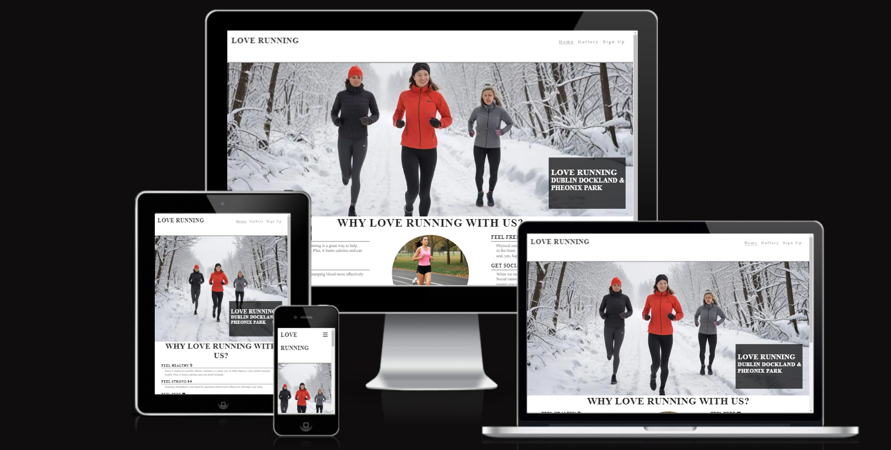

# LOVE RUNNING PROJECT

Love Running project is a love project used to describe a deep passion and enthusiasm for the activity of running.It is a project that helps people who love running find joy in the act itself, whether it's a leisurely jog through the park or an intense training session. They enjoy the rhythm, the movement, and the sense of freedom that comes with running.
The site link can be accessed through the [Link](https://ebuka-martins.github.io/LOVE-RUNNING-PROJECT/)

## Features
- __Navigation Bar_
  - featured on the top the navigation bar are all the three pages at the top right page of the love running website.
  - On the right top it shows links of Home, Gallery, and Signup which links to different pages of the Web page.
  - The navigation bar of the love running website is in a Lato San-serif font with links in normal font style and a color that contrast with the background.
   - The navigation clearly tell the users the name of the website with informations easy to find in different sections on where to signup for your registrations and gallery where to look at our work views.

- __The Home Page Section_
 
  - The homepage contains a glamourous running section of people running.
  - It also shows a section on why love running with us.
  - The reason section involves a feel healthy, feel strong, feel free and get social advert.
  - the section contains different number of daily activities for the week.
  - 

